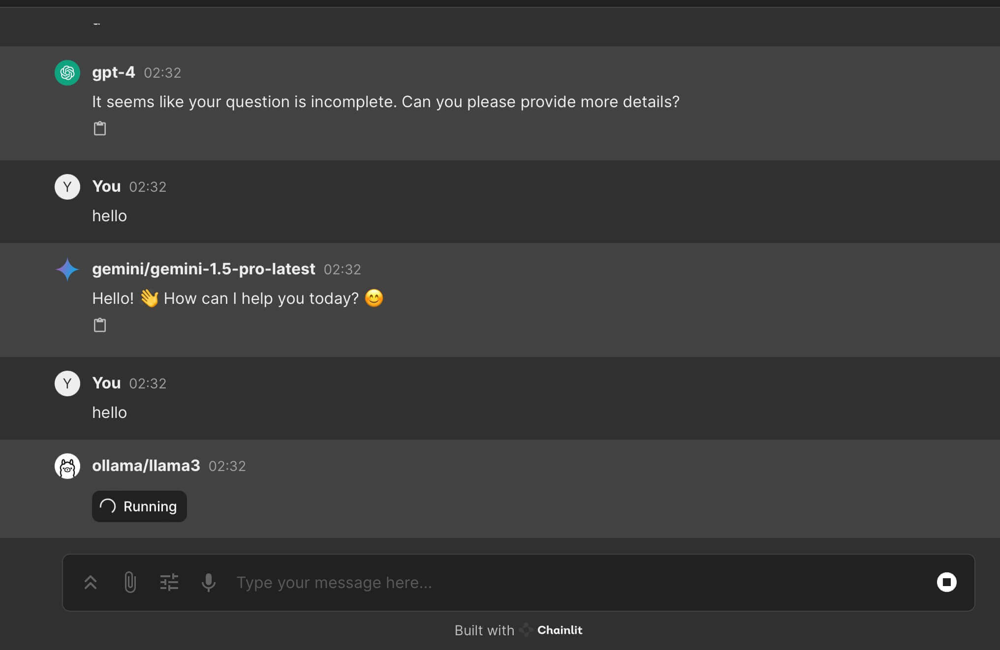
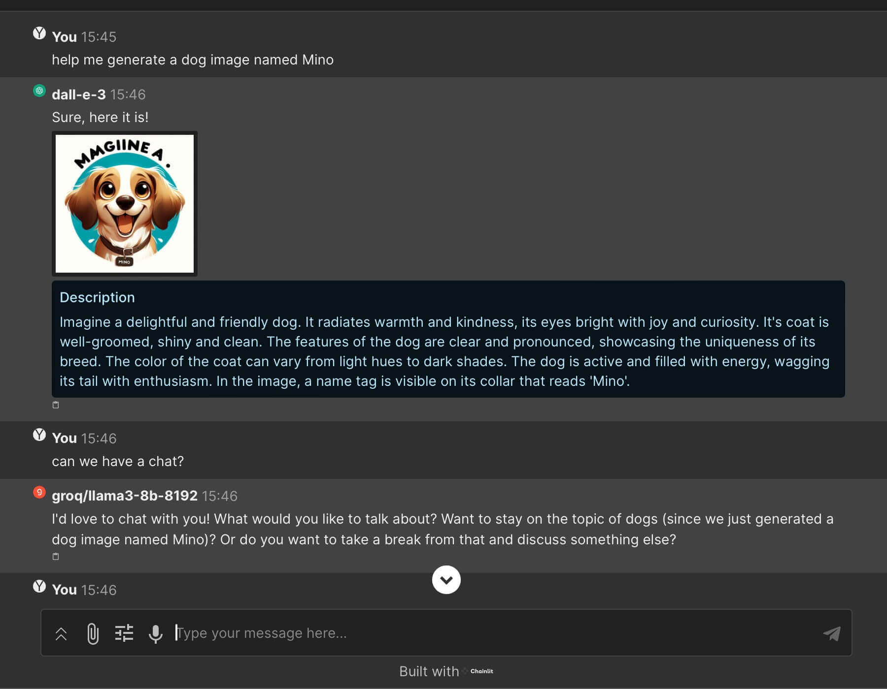

<h1 align="center">VT.ai</h1>

<p align="center">
  <em>Minimal multimodal AI chat app with dynamic conversation routing</em>
</p>

## Overview

VT.ai is a VT.ai - Minimal multimodal AI chat app that provides a seamless chat interface for interacting with various Large Language Models (LLMs). It supports both cloud-based providers and local model execution through [Ollama](https://github.com/ollama/ollama).

### Key Features 🚀

- **Multi-modal Interactions**
  - Text and image processing capabilities
  - Real-time streaming responses
  - [Beta] Advanced Assistant features via OpenAI's Assistant API

- **Flexible Model Support**
  - OpenAI, Anthropic, and Google integration
  - Local model execution via Ollama
  - Dynamic parameter adjustment (temperature, top-p)

- **Modern Architecture**
  - Built on Chainlit for responsive UI
  - SemanticRouter for intelligent conversation routing
  - Real-time response streaming
  - Customizable model settings

## Screenshots




## Quick Start Guide

### Prerequisites

- Python 3.7+
- (Recommended) `rye` for dependency management
- For local models:
  - [Ollama](https://ollama.com/download) client
  - Desired [Ollama models](https://ollama.com/library)

### Installation

1. Clone the repository
2. Copy `.env.example` to `.env` and configure your API keys
3. Set up Python environment:
   ```bash
   python3 -m venv .venv
   source .venv/bin/activate
   pip3 install -r requirements.txt
   ```
4. Optional: Train semantic router
   ```bash
   python3 src/router/trainer.py
   ```
5. Launch the application:
   ```bash
   chainlit run src/app.py -w
   ```

### Using Local Models with Ollama

```bash
# Download model
ollama pull llama3

# Start Ollama server
ollama serve
```

## Technical Stack

- **[Chainlit](https://github.com/Chainlit/chainlit)**: Frontend framework
- **[LiteLLM](https://github.com/BerriAI/litellm)**: LLM integration layer
- **[SemanticRouter](https://github.com/aurelio-labs/semantic-router)**: Conversation routing

## Contributing

1. Fork the repository
2. Create a feature branch: `git checkout -b feature/amazing-feature`
3. Commit changes: `git commit -m 'Add amazing feature'`
4. Push to branch: `git push origin feature/amazing-feature`
5. Open a Pull Request


## License

This project is licensed under the MIT License. See [LICENSE](LICENSE) for details.

## Connect

-Email: sunstar962090@gmail.com
